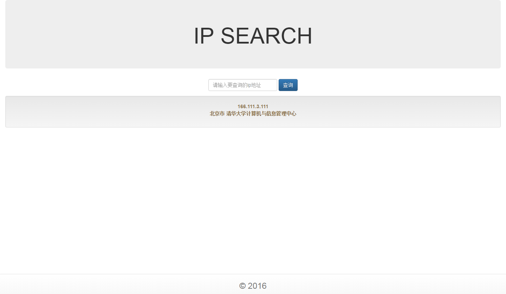

# 练习题

## 1. IP Search

> 实现一个通过 `ip` 地址查询地理位置的应用

## 2. MD5 Decrypt

> 实现一个 `MD5` “解密”应用

1. 数据为 CSDN 数据库密码

## 3. Library

> 实现一个简单的图书馆管理系统

基本功能：  
1. 管理员登录后维护图书信息  
2. 用户登录后查询图书信息  
3. 用户可以借阅图书_（管理员操作）_  
4. 用户可以归还图书_（管理员操作）_  
5. 管理员登录后查询图书借阅情况  
6. 用户登录后查询自己的借阅记录

_提高要求_  
1. 表单验证  
2. 日期控件  
2. 页面样式

## 4. Dictionary

> 仿 [http://dict.cn](http://dict.cn) 实现一个在线词典应用

基本功能  
1. 管理员登录后维护词条，增加、删除、修改、查询

* 词条属性
  1. 英文
  2. 中文
  3. 音标
  4. 词性
* 词性是下拉选择框，可初始化选项：名词、动词、形容词、副词等
  1. 所有用户都可以在线查单词
  2. `Bootstrap` 样式

_提高要求_  
1. 抓取四六级单词导入数据库  
2. 实现单词查询自动提示功能  
3. 添加单词发音  
3. 添加单词例句

## 5. Online Examination

> 实现一个在线考试系统

基本功能  
1. `教师` 登录后可以维护试题信息  
2. `学生` 注册后登录可以在线答题  
2. `教务` 登录后可以查看考试结果

_提高要求_  
1. 自动判卷  
2. 报表打印  
3. 防作弊

## 6. Short URL

> 仿 [http://tinyurl.com/](http://tinyurl.com/) 实现一个短链服务

基本功能  
1. 普通短链  
2. 定制短链

