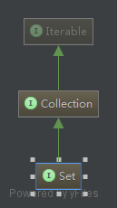
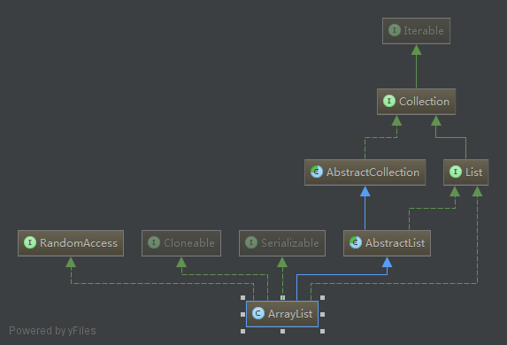
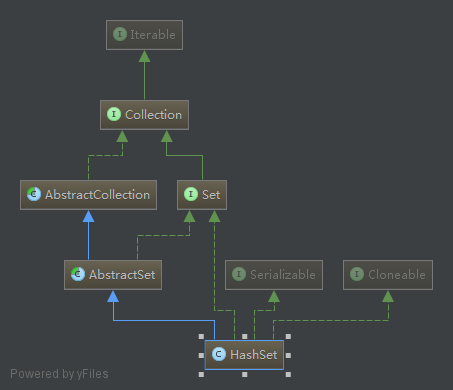
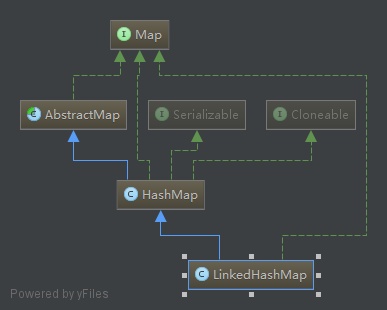
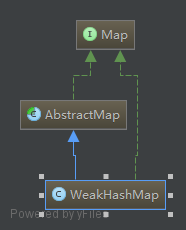

# Chapter 4 集合

> `集合` 或 `容器` 是 Java 中存放数据的重要数据结构

> 要掌握不同集合类型的 `CRUD` `Create Retrieve Update Delete` 操作和时空复杂度

1. 数组
    - 同一种类型的值的集合
    - 数组是静态的
    
    > 数组初始化之后，元素的个数不变

    - 声明和初始化
    ```java
    数据类型[] 数组名 = new 数据类型[元素的个数]; // {元素1, 元素2, ... };
    ```
    - 下标（索引） `index`
    - 循环初始化
    - 数组循环时，推荐使用 `length`
    - 遍历
    - For / Each 循环
    - 二维数组
        
        > 注意每行列数不同的二维数组
        
    - 多维数组
    - 常用方法
      - `Arrays.fill()`
      - `Arrays.copyOf()`
      - `Arrays.sort()`
      - `Arrays.toString()`
      - `System.arraycopy()`
    
2. 字符串 `java.lang.String`
    
    > 字符串初始化后，其值不能改变 `immutable`

    - `String` 的重要方法
    
        > consturctors
        
          - 略
          
        > methods
        
        - charAt
        - concact `concatenate` `[kɒn'kætɪneɪt]	`
        - contains
        - endsWith
        - equals
        - equalsIgnoreCase
        - format
        - getBytes
        - indexOf
        - isEmpty
        - lastIndexOf
        - length
        - matches
        - replace
        - replaceAll
        - replaceFirst
        - split
        - startWith
        - subString
        - toCharArray
        - toLowerCase
        - toUpperCase
        - trim
        - valueOf
    - 字符串缓冲区 `java.lang.StringBuffer`
        - append
        - delete
        - insert
        - reverse
        - setCharAt
    - `StringBuilder`
3. 向量 `java.util.Vector`
    - `Vector` 的重要方法
        - add
        - get
        - size
        - capacity
        - clear
4. 哈希表 `java.util.Hashtable`
    - `Hashtable` 中 `key` 是唯一的
    - `Hashtable` 的重要方法
        - put
        - get
        - size
        - remove
        - clear
        - keySet

## 集合框架

> The `Java Collections Framework` is a collection of interfaces and classes which helps in storing and processing the data efficiently.

### Main Interfaces
- `Iterable`
- `Collection`
  - `List`
  
    
  
  - `Set`
  
    
  
- `Map`

### List

> 有序（序列）

> 可重复元素

- `Vector`
  
  
  
- **`ArrayList`**
  
  
  
  > constructors
  
  - ArrayList()
  - ArrayList(Collection<? extends E> c)
  - **ArrayList(int initicalCapacity)**
  
  > methods
  
  - **add**
  - **addAll**
  - **size**
  - clear
  - contains
  - **get**
  - indexOf
  - isEmpty
  - lastIndexOf
  - remove
  - removeRange
  - set
  - **size**
  - toArray
  - trimToSize
  
  > extended methods
  
  - iterator
  - listIterator
  - subList
  - containsAll
  - removeAll
  - removeIf
  - retainAll
  
- `LinkedList`
  
  
  
- ArrayList Vs LinkedList
  - Search: ArrayList search operation is pretty fast compared to the LinkedList search operation. get(int index) in ArrayList gives the performance of O(1) while LinkedList performance is O(n).

  > Reason: ArrayList maintains index based system for its elements as it uses array data structure implicitly which makes it faster for searching an element in the list. On the other side LinkedList implements doubly linked list which requires the traversal through all the elements for searching an element.

  - Deletion: LinkedList remove operation gives O(1) performance while ArrayList gives variable performance: O(n) in worst case (while removing first element) and O(1) in best case (While removing last element). Conclusion: LinkedList element deletion is faster compared to ArrayList.

  > Reason: LinkedList’s each element maintains two pointers (addresses) which points to the both neighbor elements in the list. Hence removal only requires change in the pointer location in the two neighbor nodes (elements) of the node which is going to be removed. While In ArrayList all the elements need to be shifted to fill out the space created by removed element.

  - Inserts Performance: LinkedList add method gives O(1) performance while ArrayList gives O(n) in worst case. Reason is same as explained for remove.

  - Memory Overhead: ArrayList maintains indexes and element data while LinkedList maintains element data and two pointers for neighbor nodes hence the memory consumption is high in LinkedList comparatively.
  
### Set

> 不可重复元素

- `HashSet`

  > 使用 `Hashtable` 存储元素

  > 无序

  > 效率高
  
  
  
- `LinkedHashSet`

  > 使用 `Hashtable` 实现

  > 按元素添加顺序排序
  
  
  
- `TreeSet`

  > 使用 `红-黑 树` 存储元素

  > 按元素值排序
  
  
  
  
### Map

> `Key - Value` 对结构
  
- `Hashtable`
  
  
  
- `HashMap`

  > 无序
  
  
  
- `LinkedHashMap`

  > 使用 `Hashtable` 实现

  > 按元素添加顺序排序
  
  
  
- `TreeMap`

  > 使用 `红-黑 树` 存储元素

  > 按元素值排序
  
  
  
- ~~`WeakHashMap`~~
  
  
  
- ~~`IdentityHashMap`~~
  
  

### Iterator / ListIterator

- `Iterator`
- `ListIterator`

  

#### Iterator Vs ListIetrator

- Iterator 可用于遍历 List 和 Set

  > ListIterator 只能遍历 List

- Iterator 只能向前遍历

  > ListIterator 能向前或向后遍历

- 使用 Iterator 不能获得 index

  > 使用 LIstIterator 可以在任何时刻取得 index，使用 nextIndex() 和 previousIndex() 方法

- 使用 Iterator 遍历时不能添加元素，会抛出 ConcurrentModificationException 异常

  > 使用 ListIterator 遍历时可以添加元素

- 使用 Iterator 时不能替换元素

  > 使用 ListIterator 可以使用 set() 方法替换元素


- Iterator 的常用方法
  - hasNext()
  - next()
  - remove()


- ListIterator 的常用方法
  - add(E e)
  - hasNext()
  - hasPrevious()
  - next()
  - nextIndex()
  - previous()
  - previousIndex()
  - remove()
  - set(E e)

### Utils
- `Collections`
    - reverse()
    - sort()
    - singletonList() // compare with Arrays.asList()
- `Arrays`
    - asList()
    - binarySearch()
    - copyOf()
    - copyOfRange()
    - equals()
    - fill()
    - sort()
    - toString()