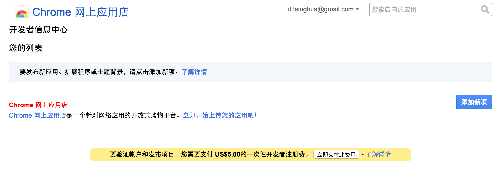
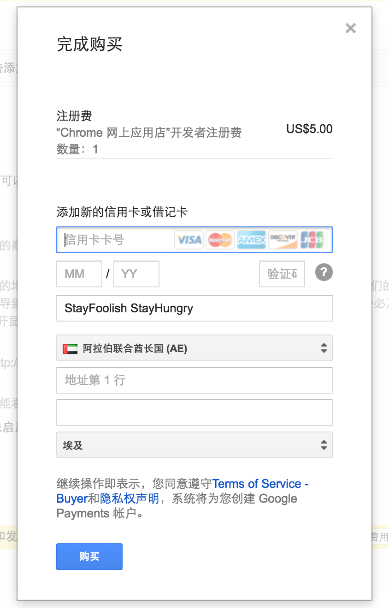

# Chrome Apps and Extensions Dev.


> [Google Chrome](https://www.google.com/chrome/browser/desktop/index.html)

1. About Chrome `[krəʊm]`
  
2. Chrome store

  > [Chrome 网上应用商店](https://chrome.google.com/webstore/category/apps)
3. Chrome developer
  
  > [Chrome 开发者中心](https://developer.chrome.com/home)
4. App Dev.
  - Create the manifest `manifest.json`

    ```json
    {
        "name": "Hello App!",
        "description": "a demo Chrome App.",
        "version": "0.1",
        "manifest_version": 2,
        "app": {
          "background": {
            "scripts": [
              "background.js"
            ]
          }
        },
        "icons": {
          "16": "icon-16.png",
          "128": "icon-128.png"
        }
    }
    ```
  
  - Create the background script `background.js`
  
    ```javascript
    chrome.app.runtime.onLaunched.addListener(function () {
        chrome.app.window.create('window.html', {
            'outerBounds': {
                'width': 400,
                'height': 500
            }
        });
    });
    ```
  - Create a window page `window.html`

    ```html
    <!DOCTYPE html>
    <html lang="en">
    <head>
        <meta charset="UTF-8">
    </head>
    <body>
    <div>Hello, App!</div>
    </body>
    </html>  
    ```
  
  - Create the icons `icon-16.png` `icon-128.png`
  
    > [ICON FINDER](https://www.iconfinder.com/)
  
  - Load the app
  
    ```
    chrome://extensions/
    check 'Developer mode'
    
    'Load unpacked extension...'
    ```
  - Launch the app

    ```
    chrome://apps
    ```
5. Extension Dev.

  > [Chrome JavaScript APIs](https://developer.chrome.com/extensions/api_index)
6. Publish your works

  > [开发者信息中心](https://chrome.google.com/webstore/developer/dashboard)

  - Developer
 
  
  
  - US$5 payment
  
  
  